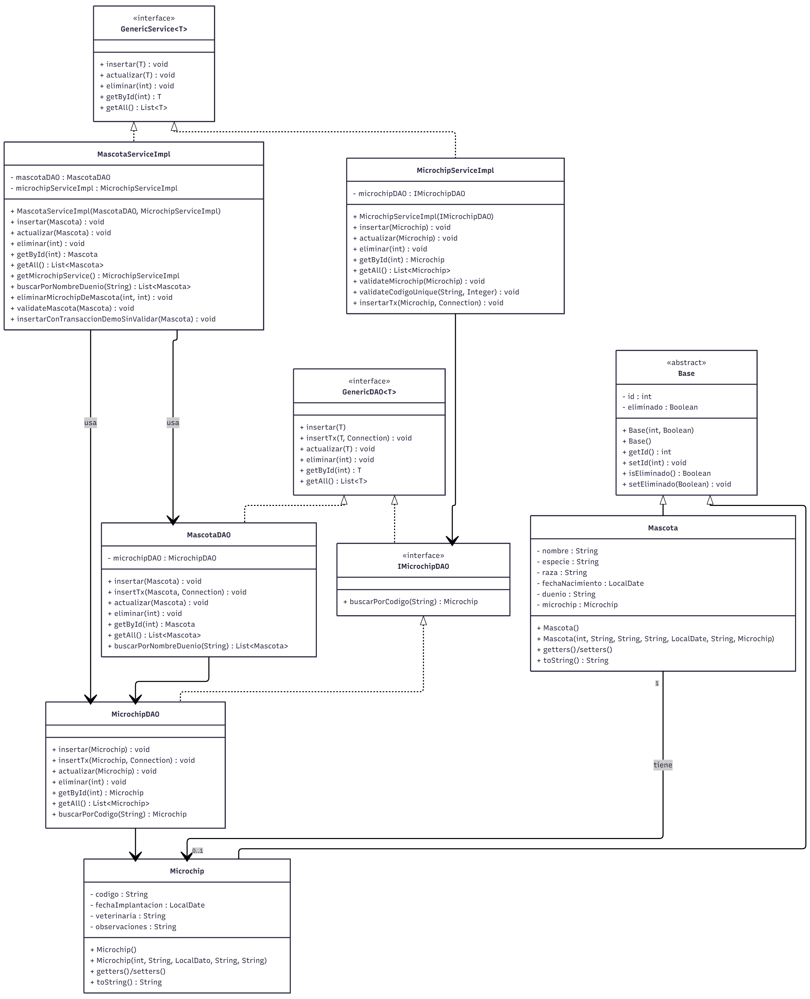

# Sistema de Gestión de Mascotas y Microchips  
### Trabajo Final Integrador – Programación II

Este proyecto implementa un sistema de registro para **Mascotas** y sus **Microchips**, utilizando arquitectura en capas, JDBC, validaciones, CRUD completo, JOINs y una **transacción real con rollback**.

---

## 1. Descripción del dominio elegido

El dominio elegido es la gestión de mascotas y microchips:

- Registrar mascotas con:
  - Nombre (obligatorio)
  - Especie (obligatorio)
  - Raza (opcional)
  - Fecha de nacimiento (opcional)
  - Dueño (obligatorio)

- Registrar microchips con:
  - Código único (obligatorio)
  - Fecha de implantación (opcional)
  - Veterinaria (opcional)
  - Observaciones (opcional)

Relación aplicada: **1 mascota ↔ 1 microchip**.

Includes validaciones, transacciones, soft delete, menú por consola y persistencia en MySQL.

---

## 2. Requisitos del entorno

Software necesario:

- Java 17+
- MySQL 8+
- Apache NetBeans 19 (recomendado)
- Driver JDBC MySQL (incluido en el proyecto)

Scripts SQL incluidos:

- script_creacion.sql
- script_datos_test.sql

---

## 3. Configuración de la base de datos

Editar credenciales en:

    src/Config/DatabaseConnection.java

Modificar:

    private static final String URL = "jdbc:mysql://HOST:PUERTO/NOMBRE_BD";
    private static final String USER = "TU_USUARIO";
    private static final String PASSWORD = "TU_PASSWORD";

Cada persona debe completar según su instalación local:

- HOST (por ejemplo: localhost)
- PUERTO (por ejemplo: 3306)
- USUARIO y PASSWORD de MySQL

---

## 4. Cómo compilar y ejecutar

1. Importar el proyecto en NetBeans.

2. Crear la base de datos en MySQL Workbench (o cualquier cliente SQL):
   - Abrir el archivo **script_creacion.sql** y ejecutarlo completo.
     Este archivo crea:
     - La base de datos `mascotas_microchips`
     - Las tablas `mascotas` y `microchips`
     - Sus claves primarias, foráneas y restricciones CHECK

   - (Opcional) Ejecutar **script_datos_test.sql** para cargar datos de prueba.  
  Este archivo inserta datos completos de prueba:

  - 15 mascotas de las cuales:  
    - 5 mascotas activas sin microchip  
    - 5 mascotas activas con microchip asignado  
    - 5 mascotas marcadas como eliminadas (=1) junto con sus microchips  

  - 15 microchips de los cuales:  
    - 5 microchips están asignados a mascotas activas
    - 5 microchips quedan libres para futuras asignaciones  
    - 5 microchips quedan marcados como eliminados (=1) por corresponder a mascotas eliminadas

     Esto permite probar:
     - Listado completo
     - LEFT JOIN funcionando
     - Mascotas con y sin microchip
     - Soft delete
     - Microchips libres para asignación

3. Ejecutar el programa:
       src/Main/AppMenu.java

## 5. Diagrama UML del Sistema

A continuación se presenta el diagrama UML completo que modela el dominio Mascotas y Microchips, incluyendo entidades, relaciones 1:1, servicios, DAOs y flujos principales:

## 6. Opciones del menú principal

1. Crear Mascota  
2. Listar Mascotas  
3. Actualizar Mascota  
4. Eliminar Mascota (soft delete)  
5. Crear Microchip  
6. Listar Microchips  
7. Actualizar Microchip por ID  
8. Eliminar Microchip por ID  
9. Actualizar Microchip por ID de Mascota  
10. Eliminar Microchip de una Mascota (seguro, actualiza FK)  
11. Crear Mascota + Microchip SIN validar (Rollback demo)  
0. Salir

---

## 7. Demostración de Transacción y Rollback (Opción 11)

Esta función permite probar una **transacción real**:

Flujo:

1. Se ingresan los datos del microchip.  
2. El microchip se **inserta dentro de una transacción** usando insertTx().  
3. Se imprime el microchip aún sin commit.  
4. Luego se ingresan los datos de la mascota.  
5. Si contiene un error (ej: dueño vacío → viola CHECK del SQL):  
   - La mascota **no se inserta**  
   - El microchip **se revierte**  
6. TransactionManager hace rollback automático.

Demuestra que:

- Ambas operaciones fueron parte de la misma transacción.  
- No quedan microchips huérfanos.  
- No se corrompe la BD.  

---

## 8. Estructura del proyecto

    src/
     ├── Config/
     │     ├── DatabaseConnection.java
     │     └── TransactionManager.java
     │
     ├── Dao/
     │     ├── GenericDAO.java
     │     ├── MascotaDAO.java
     │     ├── MicrochipDAO.java
     │     └── IMicrochipDAO.java
     │
     ├── Models/
     │     ├── Base.java
     │     ├── Mascota.java
     │     └── Microchip.java
     │
     ├── Service/
     │     ├── GenericService.java
     │     ├── MascotaServiceImpl.java
     │     └── MicrochipServiceImpl.java
     │
     └── Main/
           ├── AppMenu.java
           ├── MenuHandler.java
           └── MenuDisplay.java

---

## 9. Rol de cada capa

### Models
Solo contienen atributos, constructores y getters/setters.  
No tienen lógica de negocio.

### DAO  
Capa que interactúa directamente con MySQL usando JDBC.  
Implementa CRUD, validaciones SQL, JOINs y soft delete.

### Service  
Aplicación de reglas de negocio:  
- Validaciones de datos  
- Unicidad de microchip  
- Coordinación Mascota–Microchip  
- Transacción segura al eliminar o crear  
- Transformación de excepciones técnicas en errores legibles  

### Presentación (Main)  
Maneja el menú, el flujo del usuario, inputs y selección de operaciones.

---

FIN DEL README
